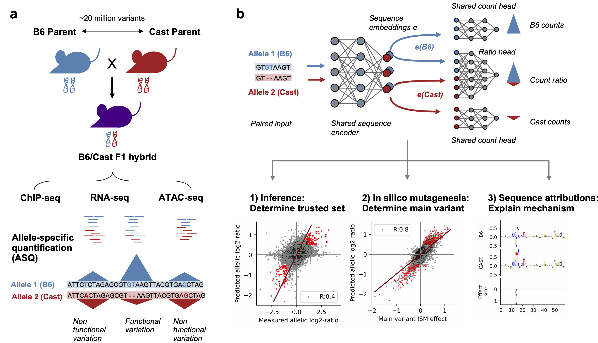

# DeepAllele: Deep genomic models of allele-specific measurements

[](https://www.gnu.org/licenses/gpl-3.0)

## Abstract 
Allele-specific quantification of sequencing data, such as gene expression, allows for a causal investigation of how DNA sequence variations influence cis gene regulation. Current methods for analyzing allele-specific measurements for causal analysis rely on statistical associations between genetic variation across individuals and allelic imbalance. Instead, we propose DeepAllele, a novel deep learning sequence-to-function model using paired allele-specific input, designed to learn sequence features that predict subtle changes in gene regulation between alleles. Our approach is especially suited for datasets with few individuals with unambiguous phasing, such as F1 hybrids and other controlled genetic crosses. We apply our framework to three types of allele-specific measurements in immune cells from F1 mice, illustrating that as the complexity of the underlying biological mechanisms increases from TF binding to gene expression, the relative effectiveness of model's architecture becomes more pronounced. Furthermore, we show that the model's learned cis-regulatory grammar aligns with known biological mechanisms across a significantly larger number of genomic regions compared to baseline models. In summary, our work presents a computational framework to leverage genetic variation to uncover functionally-relevant regulatory motifs, enhancing causal discovery in genomics.

## Overview

DeepAllele is a deep learning framework for predicting allele-specific gene regulation from DNA sequence. The framework uses a multi-head neural network architecture that learns to:



1. Predict counts for each allele (B6 and CAST in our F1 hybrid mice model)
2. Predict the ratio between alleles
3. Learn regulatory motifs that contribute to allelic imbalance

We applied the model to three types of allele-specific measurements from F1 mice:
- ChIP-seq 
- ATAC-seq
- RNA-seq

## Installation

### Prerequisites

- Python 3.9+
- CUDA-compatible GPU (recommended for model training)
- Conda or Mamba for environment management

### Set up environment

```bash
# Clone the repository
git clone https://github.com/mostafavilabuw/DeepAllele-public.git
cd DeepAllele-public

# Create conda environment
conda env create --name DeepAllele --file environment.yml
conda activate DeepAllele

# Install the DeepAllele package in development mode
pip install -e .
```

## Download trained model checkpoints and data

We provide trained model checkpoints and processed data for reproducibility. All data is available through figshare.([figshare data link](https://doi.org/10.6084/m9.figshare.28694384))

The download includes:
- Raw data (genome files, reference sequences, etc.)
- Processed datasets
- Model checkpoints for trained models

```bash
# Download trained model checkpoints and processed data
bash scripts/download_models.sh
```

This script downloads model checkpoints and data from figshare and organizes them into the correct directory structure.

## Repository Structure

- `DeepAllele/` - Main package code
  - `model.py` - Neural network model architectures
  - `data.py` - Data loading and preprocessing utilities
  - `motif_analysis.py` - Utilities for motif extraction and analysis
  - `plotlib.py` - Advanced plotting utilities
  - `surrogate_model.py` - Surrogate models for interpretability
  - `tools.py` - General utility functions
  - `io.py` - Input/output utilities
  - `nn.py` - Neural network building blocks

- `scripts/` - Scripts for data processing and analysis
  - `Analyze_model/` - Model analysis and interpretation scripts
  - `ModelTraining/` - Scripts for training models
  - `Process/` - Data processing documentation and utilities
  - `download_models.sh` - Script to download trained model checkpoints

## Data Processing

For detailed information on how to process raw sequencing data for use with DeepAllele, please refer to our [Data Processing documentation](scripts/Process/Data_processing.md). This includes steps for:

1. Allele-specific mapping
2. Creating sequence fastas for both genomes
3. Processing for both bulk and single-cell data
4. Peak calling and quantification

## Usage

### Training Models

To train a DeepAllele model:

```python
from DeepAllele import model
import pytorch_lightning as pl

# Initialize model
deepallele_model = model.SeparateMultiHeadResidualCNN(
    kernel_number=512,
    kernel_length=10,
    conv_layers=4,
    hidden_size=256
)

# Train model
trainer = pl.Trainer(max_epochs=100, gpus=1)
trainer.fit(deepallele_model, trainloader, valloader)
```

### Model Analysis

After training, you can analyze your model to extract insights about regulatory mechanisms. See our [Model Analysis documentation](scripts/Analyze_model/Analyze_models.md) for detailed steps on:

1. Making predictions with trained models
2. Computing variant effects
3. Generating sequence attributions
4. Extracting and clustering motifs
5. Analyzing mechanisms affected by variants

## Examples

The `scripts/` directory contains multiple example scripts demonstrating how to:

- Process raw sequencing data into format suitable for DeepAllele
- Train models on different data types (ChIP-seq, ATAC-seq, RNA-seq)
- Analyze trained models to extract biological insights
- Visualize motifs and variant effects

## Citation

If you use DeepAllele in your research, please cite our paper:

```
Tu, X.*, Sasse, A.*, Chowdhary, K.*, Spiro, A. E., Seddu, K., Chikina, M., Yang, L., Benoist, C. O., Mostafavi, S.
Deep genomic models of allele-specific measurements, bioRxiv (2025).
```
*Equal contribution

## License

DeepAllele is released under the [GNU General Public License v3.0](https://www.gnu.org/licenses/gpl-3.0.en.html).

## Contact

For questions or issues, please open an issue on our [GitHub repository](https://github.com/mostafavilabuw/DeepAllele-public) or contact the authors directly.


